## AWS CloudFormation

• CloudFormation is a declarative way of outlining your AWSInfrastructure, for any resources (most of them are supported)

For example, within a CloudFormation template, you say:

 - I want a security group

 - I want two EC2 instances using this security group

 - I want two Elastic IPs for these EC2 instances

 - I want an S3 bucket

 - I want a load balancer (ELB) in front of these EC2 instances

• Then CloudFormation creates those for you, in the right order, with the exact configuration that you specify

## CloudFormation – Template Example

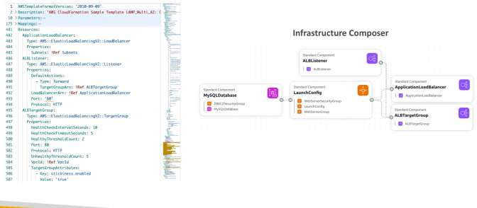

## Benefits of AWS CloudFormation (1/2)

Infrastructure as code

No resources are manually created, which is excellent for control

The code can be version controlled for example using Git

Changes to the infrastructure are reviewed through code

Cost

 - Each resources within the stack is tagged with an identifier so you can easily see how much a stack costs you

 - You can estimate the costs of your resources using the CloudFormation template

 - Savings strategy: In Dev, you could automation deletion of templates at 5 PM and recreated at 8 AM, safely

 ## Benefits of AWS CloudFormation (2/2)

Productivity

 - Ability to destroy and re-create an infrastructure on the cloud on the fly

 - Automated generation of Diagram for your templates!

 - Declarative programming (no need to figure out ordering and orchestration)

Separation of concern: create many stacks for many apps, and many layers. Ex:

 - VPC stacks

 - Network stacks

 - App stacks

Don’t re-invent the wheel

 - Leverage existing templates on the web!

 - Leverage the documentation

## How CloudFormation Works

Templates must be uploaded in S3 and then referenced in CloudFormation

To update a template, we can’t edit previous ones. We have to re- upload a new version of the template to AWS

Stacks are identified by a name

Deleting a stack deletes every single artifact that was created by CloudFormation.

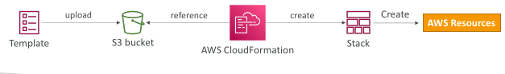

## Deploying CloudFormation Templates

Manual way
 
 - Editing templates in Infrastructure Composer or code editor
 
 - Using the console to input parameters, etc…
 
 - We’ll mostly do this way in the course for learning purposes

Automated way
 
 - Editing templates in a YAML file
 
 - Using the AWS CLI (Command Line Interface) to deploy the templates, or using a Continuous Delivery (CD) tool
 
 - Recommended way when you fully want to automate your flow

 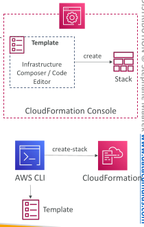

## CloudFormation – Building Blocks

Template’s Components
 
 - AWSTemplateFormatVersion – identifies the capabilities of the template “2010-09-09”
 
 - Description – comments about the template
 
 - Resources (MANDATORY) – your AWS resources declared in the template
 
 - Parameters – the dynamic inputs for your template
 
 - Mappings – the static variables for your template
 
 - Outputs – references to what has been created
 
 - Conditionals – list of conditions to perform resource creation

Template’s Helpers
 
 - References
 
 - Functions

## Introductory Example

• We’re going to create a simple EC2 instance

• And we’re going to add security group to it

• For now, forget about the code syntax

• We’ll look at the structure of the files later

• We’ll see how in no-time, we are able to get started with CloudFormation!

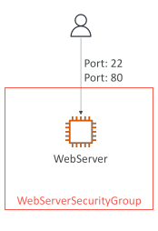

## YAML Crash Course

• YAML and JSON are the languages you canuse for CloudFormation

• JSON is horrible for CF

• YAML is great in so many ways

• Let’s learn a bit about it!

• Key value Pairs

• Nested objects

• Support Arrays

• Multi line strings

• Can include comments!

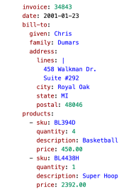

## CloudFormation – Resources

• Resources are the core of your CloudFormation template (MANDATORY)

• They represent the different AWS Components that will be created and configured

• Resources are declared and can reference each other

• AWS figures out creation, updates and deletes of resources for us

• There are over 700 types of resources (!)

Resource types identifiers are of the form:
 - service-provider::service-name::data-type-name

## How do I find Resources documentation?

• I can’t teach you all the 700+ resources, but I can teach you how to learn how to use them

• All the resources can be found here: https://docs.aws.amazon.com/AWSCloudFormation/latest/UserGuide/a ws-template-resource-type-ref.html

• Then, we just read the docs J

• Example here (for an EC2 instance): https://docs.aws.amazon.com/AWSCloudFormation/latest/UserGuide/aws-resource-ec2-instance.html

## Analysis of CloudFormation Template

• Going back to the example of the introductory lecture, let’s learn why it was written this way.

Relevant documentation can be found here:
 - https://docs.aws.amazon.com/AWSCloudFormation/latest/UserGuide/aws- resource-ec2-instance.html
 
 - https://docs.aws.amazon.com/AWSCloudFormation/latest/UserGuide/aws- resource-ec2-securitygroup.html
 
 - http://docs.aws.amazon.com/AWSCloudFormation/latest/UserGuide/aws-resource-ec2-eip.html

## CloudFormation – Resources FAQ

Can I create a dynamic number of resources?
 - Yes, you can by using CloudFormation Macros and Transform

 - It is not in the scope of this course

Is every AWS Service supported?
 - Almost. Only a select few niches are not there yet

 - You can work around that using CloudFormation Custom Resources

## CloudFormation – Parameters

• Parameters are a way to provide inputs to your AWS CloudFormation template

They’re important to know about if:
 - You want to reuse your templates across the company
 - Some inputs can not be determined ahead of time

• Parameters are extremely powerful, controlled, and can prevent errors from happening in your templates, thanks to types

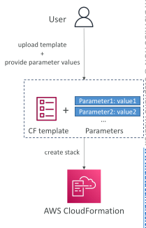

## When should you use a Parameter?

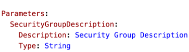

Ask yourself this:
 - Is this CloudFormation resource configuration likely to change in the future?
 - If so, make it a parameter

You won’t have to re-upload a template to change its content 

## CloudFormation – Parameters Settings

• Parameters can be controlled by all these settings:

Type:
 - String
 - Number
 - CommaDelimitedList
 - List<Number>
 - AWS-Specific Parameter (to help catch invalid values – match against existing values in the AWS account)
 - List<AWS-Specific Parameter>
 - SSM Parameter (get parameter value from SSM Parameter store)

• Description

• ConstraintDescription (String)

• Min/MaxLength

• Min/MaxValue

• Default

• AllowedValues (array)

• AllowedPattern (regex)

• NoEcho (Boolean)

## CloudFormation – Parameters Example

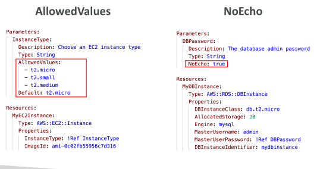

## How to Reference a Parameter?

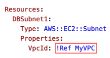

## CloudFormation – Pseudo Parameters

• AWS offers us Pseudo Parameters in any CloudFormation template

• These can be used at any time and are enabled by default

• Important pseudo parameters:

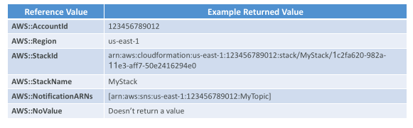

## CloudFormation – Mappings

• Mappings are fixed variables within your CloudFormation template

• They’re very handy to differentiate between different environments (dev vs prod) regions (AWS regions), AMI types…

• All the values are hardcoded within the template

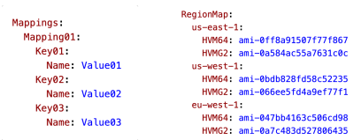

## Accessing Mapping Values (Fn::FindInMap)

• We use Fn::FindInMap to return a named value from a specific key

• !FindInMap [ MapName, TopLevelKey, SecondLevelKey ]

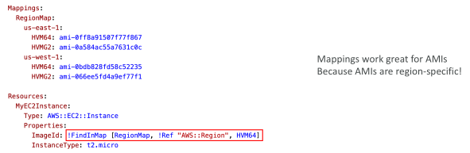

## When would you use Mappings vs. Parameters?

Mappings are great when you know in advance all the values that can be taken and that they can be deduced from variables such as
 
 - Region
 
 - Availability Zone
 
 - AWS Account
 
 - Environment (dev vs prod)
 
 - etc…

• They allow safer control over the template

• Use parameters when the values are really user specific

## CloudFormation – Outputs

• The Outputs section declares optional outputs values that we can import into other stacks (if you export them first)!

• You can also view the outputs in the AWS Console or in using the AWS CLI

• They’re very useful for example if you define a network CloudFormation, and output the variables such as VPC ID and your Subnet IDs

• It’s the best way to perform some collaboration cross stack, as you let expert handle their own part of the stack

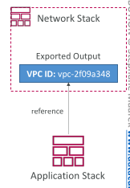

## CloudFormation – Outputs

• Creating a SSH Security Group as part of one template

• We create an output that references that security group

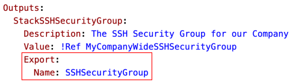

## CloudFormation – Outputs Cross-Stack Reference

• We then create a second template that leverages that security group

• For this, we use the Fn::ImportValue function

• You can’t delete the underlying stack until all the references are deleted

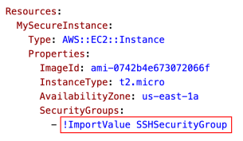

## CloudFormation – Conditions

Conditions are used to control the creation of resources or outputs based on a condition

Conditions can be whatever you want them to be, but common ones are:
 
 - Environment (dev / test / prod)
 
 - AWS Region
 
 - Any parameter value

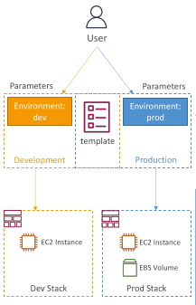

## How to define a Condition

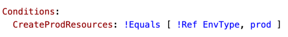

The logical ID is for you to choose. It’s how you name condition

The intrinsic function (logical) can be any of the following:

-  Fn::And

-  Fn::Equals

-  Fn::If

-  Fn::Not

-  Fn::Or

## How to use a Condition

• Conditions can be applied to resources / outputs / etc…

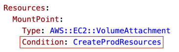

## CloudFormation – Intrinsic Functions

Ref

Fn::Base64

Fn::GetAtt

Fn::Cidr

Fn::FindInMap

Fn::GetAZs

Fn::ImportValue

Fn::Select

Fn::Join

Fn::Split

Fn::Sub

Fn::Transform

Fn::ForEach

Fn::Length

Fn::ToJsonString

Condition Functions (Fn::If, Fn::Not, Fn::Equals, etc…)

## Intrinsic Functions – Fn::Ref

The Fn::Ref function can be leveraged to reference
 
 - Parameters – returns the value of the parameter
 
 - Resources – returns the physical ID of the underlying resource (e.g., EC2 ID)

The shorthand for this in YAML is !Ref

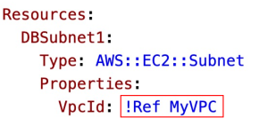

## Intrinsic Functions – Fn::GetAtt

• Attributes are attached to any resources you create

• To know the attributes of your resources, the best place to look at is the documentation

• Example: the public DNS name of an EC2 instance!

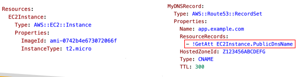

## Intrinsic Functions – Fn::FindInMap

• We use Fn::FindInMap to return a named value from a specific key

• !FindInMap [ MapName, TopLevelKey, SecondLevelKey ]

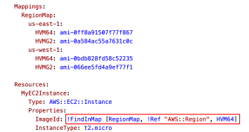

## Intrinsic Functions – Fn::ImportValue

• Import values that are exported in other stacks

• For this, we use the Fn::ImportValue function

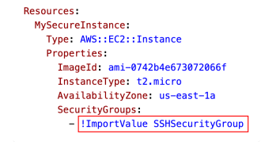

## Intrinsic Functions – Fn::Base64

• Convert String to it’s Base64 representation

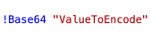

• Example: pass encoded data to EC2 Instance’s UserData property

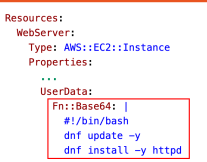

## Intrinsic Functions – Condition Functions

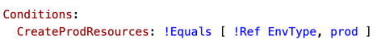

• The logical ID is for you to choose. It’s how you name condition

The intrinsic function (logical) can be any of the following:

- Fn::And

- Fn::Equals

- Fn::If

- Fn::Not

- Fn::Or

## CloudFormation – Rollbacks

Stack Creation Fails:
 - Default: everything rolls back (gets deleted). We can look at the log
 - Option to disable rollback and troubleshoot what happened

Stack Update Fails:
 - The stack automatically rolls back to the previous known working state
 - Ability to see in the log what happened and error messages

Rollback Failure? Fix resources manually then issue ContinueUpdateRollback API from Console
 - Or from the CLI using continue-update-rollback API call

## CloudFormation – Service Role

IAM role that allows CloudFormation to create/update/delete stack resources on your behalf

Give ability to users to create/update/delete the stack resources even if they don’t have permissions to work with the resources in the stack

Use cases:
 
 - You want to achieve the least privilege principle
 
 - But you don’t want to give the user all the required permissions to create the stack resources

• User must have iam:PassRole permissions

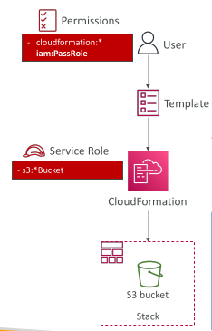

## CloudFormation Capabilities

CAPABILITY_NAMED_IAM and CAPABILITY_IAM

 - Necessary to enable when you CloudFormation template is creating or updating IAM resources (IAM User, Role, Group, Policy, Access Keys, Instance Profile…)

 - Specify CAPABILITY_NAMED_IAM if the resources are named

CAPABILITY_AUTO_EXPAND

 - Necessary when your CloudFormation template includes Macros or Nested Stacks (stacks within stacks) to perform dynamic transformations

 - You’re acknowledging that your template may change before deploying

InsufficientCapabilitiesException

 - Exception that will be thrown by CloudFormation if the capabilities haven’t been acknowledged when deploying a template (security measure)

## CloudFormation – DeletionPolicy Delete

DeletionPolicy:
 - Control what happens when the CloudFormation template is deleted or when a resource is removed from a CloudFormation template
 - Extra safety measure to preserve and backup resources

Default DeletionPolicy=Delete
 - Delete won’t work on an S3 bucket if the bucket is not empty

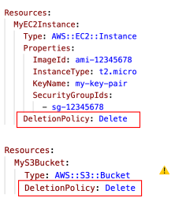

## CloudFormation – DeletionPolicy Retain

DeletionPolicy=Retain:
 - Specify on resources to preserve in case of CloudFormation deletes

Works with any resources

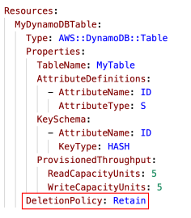

## CloudFormation – DeletionPolicy Snapshot

• DeletionPolicy=Snapshot

• Create one final snapshot before deleting the resource

Examples of supported resources:

- EBS Volume, ElastiCache Cluster, ElastiCache ReplicationGroup

- RDS DBInstance, RDS DBCluster, Redshift Cluster, Neptune DBCluster, DocumentDB DBCluster

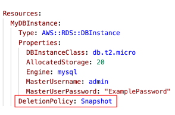

## CloudFormation – Stack Policies

• During a CloudFormation Stack update, all update actions are allowed on all resources (default)
• A Stack Policy is a JSON document that defines the update actions that are allowed on specific resources during Stack updates

• Protect resources from unintentional updates

• When you set a Stack Policy, all resources in the Stack are protected by default

• Specify an explicit ALLOW for the resources you want to be allowed to be updated

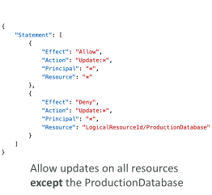

## CloudFormation – Termination Protection

• To prevent accidental deletes of CloudFormation Stacks, use TerminationProtection

## CloudFormation – Custom Resources

Used to
 
 - define resources not yet supported by CloudFormation
 
 - define custom provisioning logic for resources can that be outside of CloudFormation (on-premises resources, 3rd party resources…)
 
 - have custom scripts run during create / update / delete through Lambda functions (running a Lambda function to empty an S3 bucket before being deleted)

• Defined in the template using AWS::CloudFormation::CustomResource or Custom::MyCustomResourceTypeName (recommended)

• Backed by a Lambda function (most common) or an SNS topic

## How to define a Custom Resource?

• ServiceToken specifies where CloudFormation sends requests to, such as Lambda ARN or SNS ARN (required & must be in the same region)

• Input data parameters (optional)

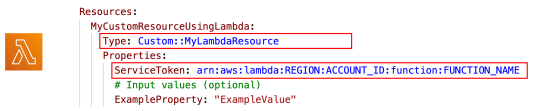

## Use Case – Delete content from an S3 bucket

• You can’t delete a non-empty S3 bucket

• To delete a non-empty S3 bucket, you must first delete all the objects inside it

• We can use a custom resource to empty an S3 bucket before it gets deleted by CloudFormation

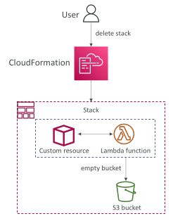

## Custom Resources – How does it work?

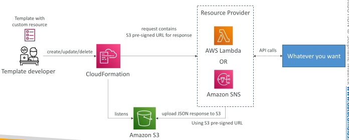

## Hands-On: Lambda-backed Custom Resource

• You can’t delete a non-empty S3 bucket

• To delete a non-empty S3 bucket, you must first delete all the objects inside it

• We’ll create a custom resource with AWS Lambda that will be used to empty an S3 bucket before deleting it

• Let’s create our first Custom Resource!

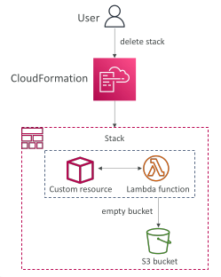

## CloudFormation – Dynamic References

• Reference external values stored in Systems Manager Parameter Store and Secrets Manager within CloudFormation templates

• CloudFormation retrieves the value of the specified reference during create/update delete operations

• For example: retrieve RDS DB Instance master password from Secrets Manager

Supports
 - ssm – for plaintext values stored in SSM Parameter Store
 - ssm-secure – for secure strings stored in SSM Parameter Store
 - secretsmanager – for secret values stored in Secrets Manager
  ‘{{resolve:service-name:reference-key}}’

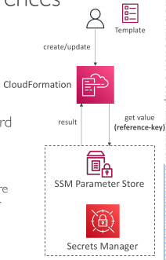

## CloudFormation – Dynamic References

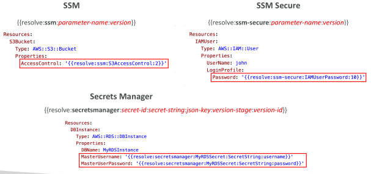

## CloudFormation, Secrets Manager & RDS Option 1 – ManageMasterUserPassword

• ManageMasterUserPassword – creates admin secret implicitly

• RDS, Aurora will manage the secret in Secrets Manager and its rotation

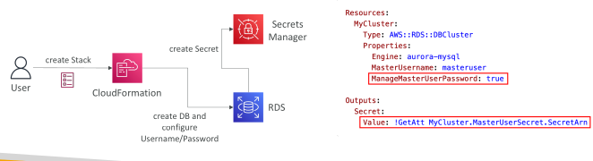

## CloudFormation, Secrets Manager & RDS Option 2 – Dynamic Reference

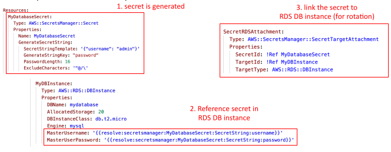

## User Data in EC2 for CloudFormation

• We can have user data at EC2 instance launch through the console

• Let’s learn how to write the same EC2 user-data script in our CloudFormation template

• The important thing to pass is the entire script through the function Fn::Base64

• Good to know, user data script log is in /var/log/cloud-init-output.log

• Let’s see how to do this in CloudFormation!

## The Problems with EC2 User Data

• What if we want to have a very large instance configuration?

• What if we want to evolve the state of the EC2 instance without terminating it and creating a new one?

• How do we make EC2 user-data more readable?

• How do we know or signal that our EC2 user-data script completed successfully?

Enter CloudFormation Helper Scripts!
 - Python scripts, that come directly on Amazon Linux AMIs, or can be installed using yum or dnf on non-Amazon Linux AMIs
 - cfn-init, cfn-signal, cfn-get-metadata, cfn-hup

## AWS::CloudFormation::Init

• A config contains the following and is executed in that order
 
 - Packages: used to download and install pre-packaged apps and components on Linux Windows (ex. MySQL, PHP, etc…)
 
 - Groups: define user groups
 
 - Users: define users, and which group they belong to
 
 - Sources: download files and archives and place them on the EC2 instance
 
 - Files: create files on the EC2 instance, using inline or can be pulled from a URL
 
 - Commands: run a series of commands
 
 - Services: launch a list of sysvinit

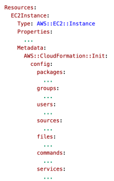

## CloudFormation – cfn-init

• Used to retrieve and interpret the resource metadata, installing packages, creating files and starting services

• With the cfn-init script, it helps make complex EC2 configurations readable

• The EC2 instance will query the CloudFormation service to get init data

• AWS::CloudFormation::Init must be in the Metadata of a resource

• Logs go to /var/log/cfn-init.log

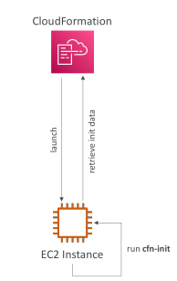

## CloudFormation – cfn-signal & Wait Conditions

• We still don’t know how to tell CloudFormation that the EC2 instance got properly configured after a cfn-init
• For this, we can use the cfn-signal script!
• We run cfn-signal right after cfn-init
• Tell CloudFormation service that the resource creation success/fail
to keep on going or fail
• We need to define WaitCondition:
• Block the template until it receives a signal from cfn-signal
• We attach a CreationPolicy (also works on EC2, ASG)
• We can define a Count > 1 (in case you need more than 1 signal)

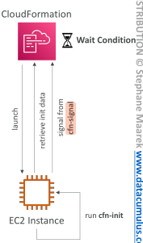